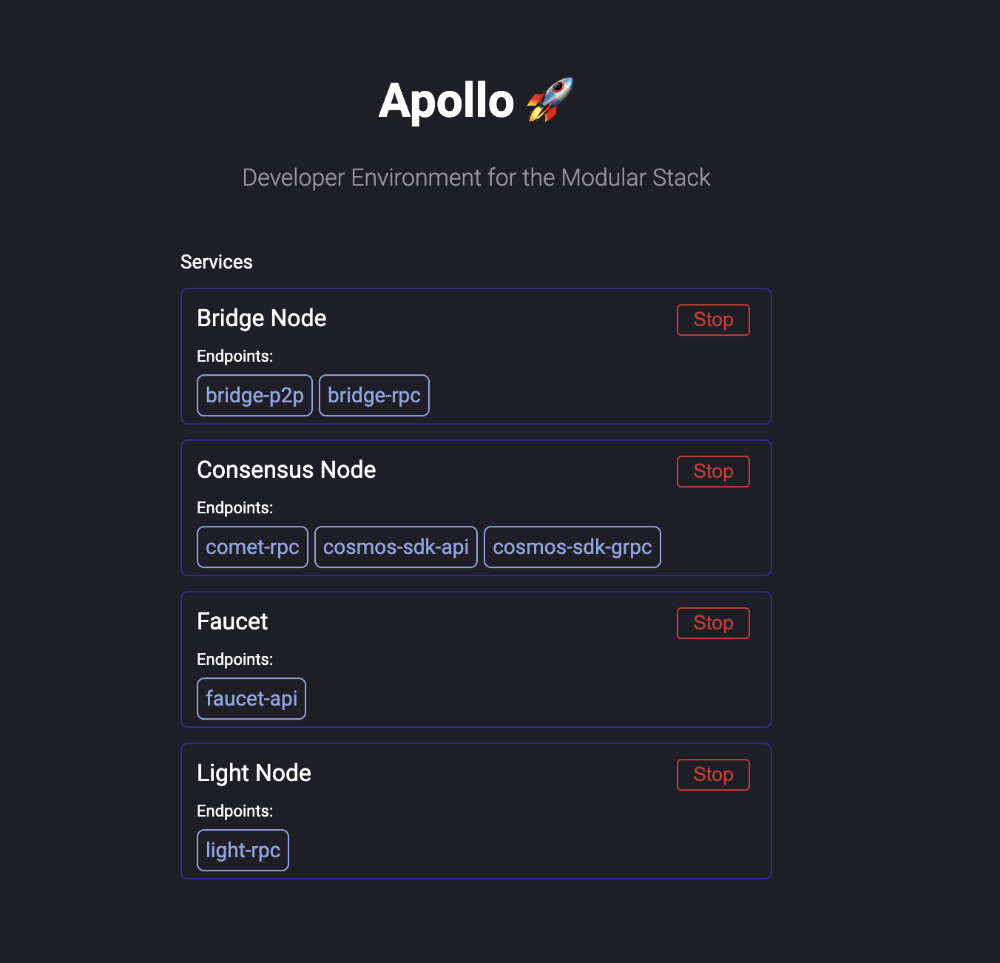

# Apollo 🚀

Apollo exists to simplify development of the modular stack. It's a one click deploy local and easily extendable Celestia network.

## Getting Started

To deploy **from source**, clone the repo and install the binary by running:

```bash
<<<<<<< HEAD
git clone https://github.com/celestiaorg/apollo.git && cd apollo
go install cmd/main.go
```

From there, you can run the binary with the following command:

```bash
apollo up
```

This will start the control panel and all services.

Go to `http://localhost:8080` to view the control panel. This will show which services are running along with the URLs



## Base Services

The cli tool comes with four services built-in `Consensus Node`, `Bridge Node`, `Light Node`, and `Faucet`. With these alone you can easily fund your sequencer and deploy your rollup, using the light client to verify the blobs as they are published.

## Faucet

The binary comes with a faucet for easily funding accounts. By default it will be hosted at `http://localhost:1095`. You can use the API by sending a GET request to `http://localhost:1095/fund/<your_celestia_address>`


### REST API

- `/fund/<celestia_address>`: Funds the listed celestia address returning the transaction hash if successful or an error
- `/status`: Returns the status of the faucet, including the faucet account and any configurations

## Authentication tokens

To view your authentication token for the Apollo light node, use the following command:

```bash
celestia light auth admin --node.store $HOME/.apollo/light-node
```

## Adding Services

The atomic unit of this development kit is a service. It can be seen as an arbitrary process that requires certain inputs denoted as endpoints and providing certain outputs also in the form of endpoints. These are predominantly used as the ports these services will communicate across. These services can be started and stopped.

The CLI uses the `Conductor` with four out of the box services. To add more, write a wrapper of your service that matches the `Service` interface. Create your own binary with the standard services and your new service.

## Contributing

This repo is still a work in progress. If you would like to improve it or notice a bug, feel free to open an issue or PR.
